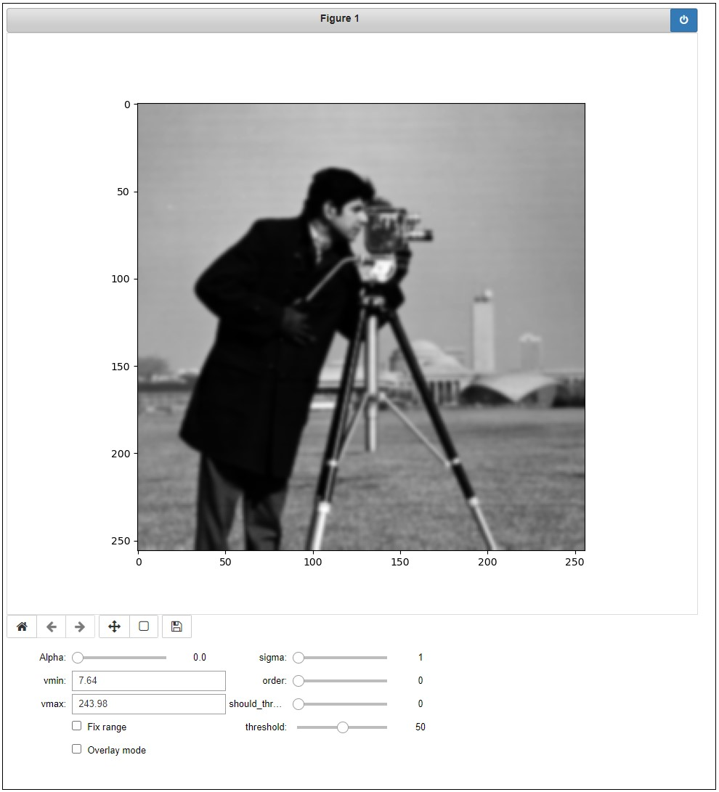

# Simple script for interactive manipulation of images on Jupyter notebooks

The script allows an easy generation of an interface for changing parameters related to some image processing task. For instance, at the bottom of the image below, the widgets on the right are all associated with parameters of a Gaussian smoothing followed by a derivative and a threshold. It is possible to change each parameter and see the results interactively. 



Usage:

```python
from image_explorer import InteractiveExperimenter
...
ie = InteractiveExperimenter(parameters, function)
ie.run(img)
```

Please see [example.ipynb](example.ipynb) for a complete example. Also, the documentation of the class InteractiveExperimenter contains additional explanations regarding parameters.

Widgets at the bottom left containg some useful commands. They are:

* Alpha: when "Overlay mode" is not on, this slider can be used for changing between the processed and the original image (tip: you can click on the slider and use the arrow keys). When "Overlay mode" is on, the processed image is expected to be a binary image, and this parameter controls the opacity of the binary image.
* vmin: when "Fix range" is off, shows the minimum intensity value of the image. When "Fix range", sets the minimum intensity for the colormap (similar to vmin from matplotlib.pyplot.imshow)
* vmax: same as above, but for the maximum value
* Fix range: if off, the vmin and vmax values are automatically adjusted according to the minimum and maximum values in the image. This can lead to misleading visualizations. When this is on, vmin and vmax do not automatically change. They still can be changed by entering new values in the respective text boxes.
* Overlay mode: if on, the processed image is overlaid on top of the original image. Note that the processed image is expected to be a binary image. When this is on, vmin and vmax can still be used for adjusting the limits of the colormap.